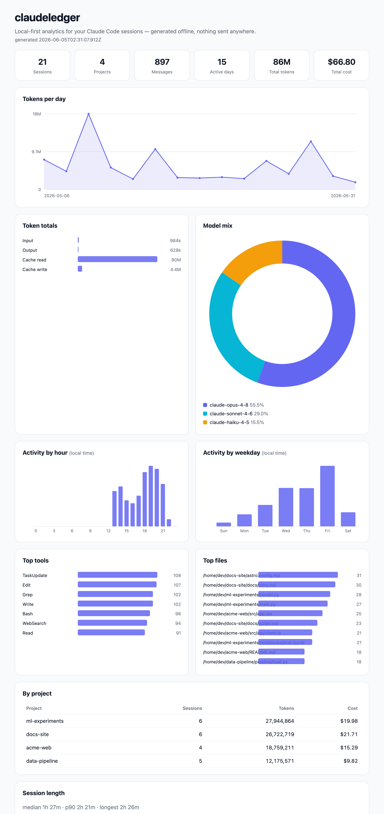

# claudeledger

**Local-first analytics for your Claude Code sessions.** Point it at your own
session logs and get cost, token burn, tool-call patterns, most-touched files,
and time-of-day productivity — as a terminal summary or a self-contained HTML
dashboard.

> 🔒 **It runs entirely offline.** claudeledger only reads JSONL files under
> `~/.claude` on your machine and **never makes a single network call.** No
> telemetry, no uploads, no accounts. The generated HTML report is one
> self-contained file with no external assets, so it's private too.

Existing tools render your Claude Code transcripts. claudeledger is about
**insight** — what you spent, where the tokens went, and when you actually work.

---

## The HTML report

`npx claudeledger --html` writes a single `report.html` (charts inlined as
hand-drawn SVG — no chart library, no CDN) and opens it in your browser:



*(Generated from synthetic sample data via `scripts/gen-demo.mjs` — no real
paths here.)*

## The terminal summary

`npx claudeledger` prints a summary table:

```
claudeledger  ·  21 sessions · 4 projects · 15 active days

┌───────────────┬────────────┐
│ Messages      │ 897        │
├───────────────┼────────────┤
│ Input tokens  │ 983,559    │
├───────────────┼────────────┤
│ Output tokens │ 627,962    │
├───────────────┼────────────┤
│ Cache read    │ 79,629,825 │
├───────────────┼────────────┤
│ Cache write   │ 4,361,019  │
├───────────────┼────────────┤
│ Total cost    │ $66.80     │
└───────────────┴────────────┘
session length — median 1h 27m, p90 2h 21m, longest 2h 26m

Top tools
┌────────────┬───────┐
│ tool       │ calls │
├────────────┼───────┤
│ TaskUpdate │   108 │
│ Edit       │   107 │
│ Grep       │   102 │
└────────────┴───────┘

... top files, per-project rollup, model mix, and a per-day token sparkline:

Tokens per day
  ▃▁█▂▃▁▁▁▁▂▁▆▂▁▁
```

---

## Quickstart (no install)

```sh
npx claudeledger            # summary table for all projects, all time
npx claudeledger --html     # write report.html and open it
```

Requires Node ≥ 24.

---

## What it reads (and the privacy guarantee)

Claude Code writes one JSONL file per session under:

```
~/.claude/projects/<encoded-project-path>/<session-id>.jsonl
```

claudeledger discovers and reads those files locally. The discovery logic lives in
[`src/discover.ts`](src/discover.ts) — `resolveRoot()` decides where to look and
`discoverSessions()` enumerates the files. There is no `fetch`, no `http`, no
socket anywhere in the runtime path. You can verify it yourself:

```sh
grep -rEi 'fetch|http|net' dist/   # → nothing
```

The only time claudeledger shells out is to open the finished HTML report in your
browser (`open`/`xdg-open`/`start`) — see [`src/util/open.ts`](src/util/open.ts).

---

## Commands & flags

```
claudeledger                      # summary table for ALL projects, all time
claudeledger --project <name>     # filter to projects whose path contains <name>
claudeledger --since "7 days ago" # date filter (ISO dates + natural language)
claudeledger --until <date>
claudeledger --html               # write report.html and open it in the browser
claudeledger --out <path>         # custom output path for the HTML
claudeledger --json               # machine-readable JSON stats to stdout (for piping)
claudeledger --root <path>        # override ~/.claude (also: CLAUDE_ROOT env var)
claudeledger --top <n>            # rows in "top files"/"top tools" (default 10)
claudeledger --verbose            # show skipped-line counts, timing, parse warnings
claudeledger --dump-schema        # print observed event types + keys, then exit
claudeledger --version / --help
```

Time-of-day and weekday histograms are bucketed in your **local** timezone.

---

## How costs are calculated

`cost = tokens × per-model price`, summed across every assistant message. Input,
output, cache-read, and cache-write tokens are tracked and priced separately —
cache reads are ~10× cheaper than fresh input, so conflating them would wreck the
number.

Prices live in a single editable map, [`src/pricing.ts`](src/pricing.ts), keyed
by model id, with a `LAST_UPDATED` date and a link to Anthropic's pricing page.
**Prices are never fetched at runtime.** When claudeledger sees a model id that isn't
in the map, it still counts the tokens but reports the cost as *unknown* and
prints a one-line warning — update `pricing.ts` and re-run. (Zero-token models
like Claude Code's `<synthetic>` placeholder are ignored, so they don't blank out
your cost.)

---

## A note on the log format

The Claude Code JSONL format is **undocumented and evolving** — Anthropic
publishes no spec, and fields change between versions (this repo was tested
against 11 different Claude Code versions in one log set). claudeledger parses
defensively: every field is optional, unparseable lines are skipped and counted,
and file operations are detected by the *shape* of a tool's input (presence of a
`file_path`) rather than hard-coded tool names. When the format drifts and
something looks off, run `claudeledger --dump-schema` to see what's actually on disk —
and PRs are welcome.

---

## Development

```sh
corepack enable
corepack prepare pnpm@10.15.1 --activate
pnpm install
pnpm build        # bundle to dist/ with tsup
pnpm test         # vitest (analyze.ts is covered against known-answer fixtures)
pnpm typecheck    # tsc --noEmit

# generate the synthetic demo dataset + try it
node scripts/gen-demo.mjs .demo-claude
node dist/cli.js --root .demo-claude --html
```

The core (`src/analyze.ts`) is a **pure** function — events in, stats out, no
filesystem and no clock (the timestamp is injected). All IO lives in
`discover.ts` / `cli.ts`. That's what makes the analytics trivially testable.

## Contributing

Issues and PRs welcome — especially when the log format drifts. Keep
`analyze.ts` pure and add a fixture with known numbers for any new metric.

## License

[MIT](LICENSE)
